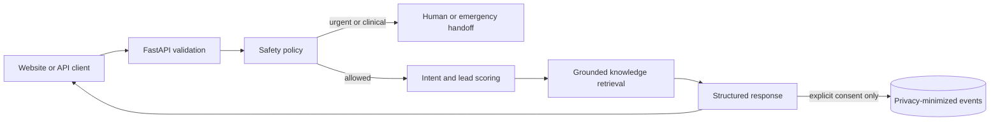

# Nyxora Lead Concierge

[](https://github.com/Ryork67677/nyxora-lead-concierge/actions/workflows/ci.yml)
[](https://www.python.org/)
[](LICENSE)

A privacy-conscious lead qualification and human-handoff API built by **Russell York**.
It is the code-first companion to the broader Nyxora automation platform and demonstrates
API design, grounded retrieval, safety controls, evaluation, testing, persistence, and
containerized deployment.

> **Project status:** v0.1 safety baseline. Responses are grounded in a versioned knowledge
> base and deterministic policy layer. A model-backed response generator will only be added
> behind these controls, so model output cannot bypass escalation or evaluation rules.

This educational project does not provide medical advice and is not connected to real customer
data or a healthcare provider.

## Why this project exists

Lead assistants can create business value, but an unguarded chatbot can invent prices, promise
appointments, expose private data, or answer clinical questions it should escalate. This project
uses a fail-closed design:

- Answers come from a small, reviewable knowledge base.
- Clinical and urgent language is handled before general response logic.
- Unverified answers, cancellations, and pricing requests can be routed to a person.
- Raw messages and session IDs are not stored.
- Automated evaluation measures intent, action, handoff, and safety behavior.

## Capabilities

- `POST /v1/chat` with validated, structured input and output
- Intent classification and transparent 0–100 lead qualification
- Grounded retrieval with visible knowledge-source names
- Emergency, clinical-review, and prompt-injection detection
- Explicit `answer`, `book_consultation`, `human_handoff`, and `emergency_help` actions
- Consent-gated SQLite event storage using hashed session identifiers
- FastAPI interactive documentation at `/docs`
- Docker runtime, GitHub Actions CI, linting, tests, and behavior evaluations

## Architecture



The system is a modular monolith so the behavior remains easy to run, test, and explain. See
[the architecture guide](docs/architecture.md) and
[ADR-0001](docs/adr/0001-modular-grounded-baseline.md) for the design trade-offs.

## Quick start

Requirements: Python 3.11 or newer.

```bash
python -m venv .venv
source .venv/bin/activate  # Windows PowerShell: .venv\Scripts\Activate.ps1
python -m pip install -e ".[dev]"
uvicorn nyxora_concierge.main:app --reload
```

Open `http://127.0.0.1:8000/docs`, or send a request:

```bash
curl -X POST http://127.0.0.1:8000/v1/chat \
  -H "Content-Type: application/json" \
  -d '{
    "session_id": "demo-session-001",
    "message": "I am a first-time client and want to book a consultation next week. Please text me.",
    "consent_to_store": false
  }'
```

Example response:

```json
{
  "response": "Appointment requests require a preferred service, date range, and contact method...",
  "intent": "booking",
  "qualification_score": 100,
  "recommended_action": "book_consultation",
  "requires_human": false,
  "safety_flags": [],
  "knowledge_sources": ["Appointment requests", "Consultations"],
  "stored": false
}
```

## Test and evaluate

```bash
ruff check .
pytest
python -m nyxora_concierge.evaluation
```

The evaluation suite contains ordinary lead questions, unsupported questions, clinical edge
cases, urgent symptoms, and a prompt-injection attempt. CI requires at least a 90% end-to-end
case pass rate and 85% test coverage. These are initial engineering gates, not claims of clinical
validation or production readiness.

Verified locally on July 14, 2026:

| Check | Result |
|---|---:|
| Automated tests | 18 passed |
| Code coverage | 94% |
| Behavior evaluation | 12/12 cases passed |
| Safety-case recall | 100% |

## Privacy and safety choices

- Storage is disabled unless `consent_to_store` is true.
- Even with consent, the application stores only outcome metadata and a SHA-256 session hash.
- It never stores raw chat messages, names, phone numbers, or email addresses.
- The knowledge base is synthetic and contains no client or proprietary business information.
- The assistant never diagnoses, guarantees results, invents availability, or replaces a clinician.

See [SECURITY.md](SECURITY.md) for limitations and safe reporting.

## Roadmap

- [x] Grounded knowledge retrieval and explicit citations
- [x] Lead qualification and action routing
- [x] Safety, privacy, and human-handoff policies
- [x] Automated tests and behavior evaluation
- [x] Docker and continuous integration
- [ ] Add a provider-neutral LLM adapter behind the policy layer
- [ ] Expand the evaluation set to 100 reviewed cases
- [ ] Add authenticated aggregate metrics and an observability dashboard
- [ ] Run a documented red-team review before any real-world pilot

## Honest scope

Russell York designed the project direction, requirements, safety behavior, and portfolio story
with AI-assisted implementation. All code is intended to be reviewed, tested, understood, and
iteratively improved by the project owner. The repository does not claim production deployment,
clinical validation, or real customer usage.
